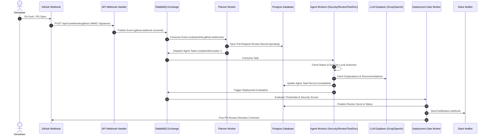

# CodeSentinel — Autonomous Multi-Agent Code Review & Deployment Gating Platform

CodeSentinel is a production-grade, microservices-driven code analysis and quality verification platform. It automates the review of pull requests through coordinate agent daemons running local analyzers (Bandit, Gitleaks, Semgrep, Trivy, and pip-audit) and leverages advanced LLMs (configured with Groq's `llama-3.3-70b-versatile` endpoint) to provide rich vulnerability explanations, code fix recommendations, and dynamic deployment gating.

---

## 🏗️ Architectural Flow



---

## 🚀 Key Modules & Directory Mapping

### Backend Layer
* [backend/app/main.py](file:///c:/Users/Pranay%20Shah/Documents/Security%20Reviewer/backend/app/main.py): Application lifespan manager initializing connection pools for Postgres, Redis client caching, and RabbitMQ exchanges.
* [backend/app/services/review_coordinator.py](file:///c:/Users/Pranay%20Shah/Documents/Security%20Reviewer/backend/app/services/review_coordinator.py): Review orchestrator assessing deployment gating thresholds and dispatching final review statuses.
* [backend/app/workers/planner_worker.py](file:///c:/Users/Pranay%20Shah/Documents/Security%20Reviewer/backend/app/workers/planner_worker.py): Ingestion queue listener that maps webhook activities into review blueprints.
* [backend/app/workers/deployment_worker.py](file:///c:/Users/Pranay%20Shah/Documents/Security%20Reviewer/backend/app/workers/deployment_worker.py): Gating executor validating if a review's security and quality metrics satisfy gating parameters.

### Frontend Layer
* [frontend/src/app/page.tsx](file:///c:/Users/Pranay%20Shah/Documents/Security%20Reviewer/frontend/src/app/page.tsx): Main landing page displaying active scans, average review metrics, and quality scoring cards.
* [frontend/src/app/monitoring/page.tsx](file:///c:/Users/Pranay%20Shah/Documents/Security%20Reviewer/frontend/src/app/monitoring/page.tsx): System heartbeats monitoring panel tracking database latencies and microservice worker lifespans.
* [frontend/src/components/RepositoriesListClient.tsx](file:///c:/Users/Pranay%20Shah/Documents/Security%20Reviewer/frontend/src/components/RepositoriesListClient.tsx): Administrative settings to link or unlink repositories and configure deployment gating parameters.

---

## 📦 Getting Started

### 1. Copy Environment File
Duplicate the environment file:
```bash
cp .env.example .env
```
Ensure you update the keys if you wish to configure live integrations:
* `OPENAI_API_KEY`, `OPENAI_API_BASE`, and `OPENAI_MODEL` (Defaults to Groq's model `llama-3.3-70b-versatile`).
* `GITHUB_CLIENT_ID` & `GITHUB_CLIENT_SECRET` (For OAuth login; falls back to mock developer logins if omitted).
* `SLACK_WEBHOOK_URL` (For completions message dispatching).

### 2. Start the Infrastructure Stack
Bring up the PostgreSQL database, RabbitMQ server, Redis cache, backend API gateway, frontend dashboard, and all independent task workers using:
```bash
docker compose up --build
```
The services will be available at:
* **Frontend Web Application:** `http://localhost:3000`
* **Backend API Documentation:** `http://localhost:8000/docs`

---

## 🔍 Validation & Testing

### Simulating Scans
To simulate scans locally without configuring live GitHub webhooks, run the execution test scripts:
* **Vulnerable Repository Scan (`pallets/flask`):**
  ```bash
  .venv/Scripts/python trigger_review.py
  ```
* **Clean Repository Scan (`octocat/Hello-World`):**
  ```bash
  .venv/Scripts/python trigger_clean_review.py
  ```

### Running Backend Tests
Execute unit and integration tests locally:
```bash
cd backend
../.venv/Scripts/python -m pytest
```

### Checking Lints
```bash
# Backend Linting
../.venv/Scripts/python -m ruff check backend
# Frontend Linting
cd ../frontend
npm run lint
```
