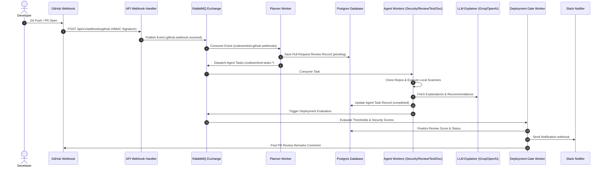

# CodeSentinel — Autonomous Multi-Agent Code Review & Deployment Gating Platform

CodeSentinel is a production-grade, microservices-driven code analysis and quality verification platform. It automates the review of pull requests through coordinate agent daemons running local analyzers (Bandit, Gitleaks, Semgrep, Trivy, and pip-audit) and leverages advanced LLMs (configured with Groq's `llama-3.3-70b-versatile` endpoint) to provide rich vulnerability explanations, code fix recommendations, and dynamic deployment gating.

---

## 🎯 What is CodeSentinel?
Traditional static analysis security tools (SAST) produce raw scanner logs with high false-positive rates and minimal context, making it hard for developers to resolve findings. CodeSentinel bridges this gap by acting as an **Autonomous AI Code Reviewer and CI/CD Gatekeeper**:

1. **Ingests Code Events:** Listens to GitHub Pull Request webhooks securely.
2. **Runs Scanners Locally:** Clones the code and runs 5 security scan engines (Bandit, Gitleaks, Semgrep, Trivy, pip-audit).
3. **Enriches with AI:** Translates raw scanner findings into clear explanations, concrete mitigation steps, and copy-pasteable code fixes using Groq/OpenAI LLM models.
4. **Performs Multi-Agent Audits:** Scans code for architecture, test coverage, and documentation.
5. **Gates Deployments:** Automatically blocks pull requests that do not meet minimum security or quality score thresholds.
6. **Displays Real-time Diagnostics:** Features a Next.js control panel showing review history, detailed reports, and microservices heartbeat monitoring.

---

## 🏗️ Architectural Flow

Here is how data flows through the platform when a developer opens a Pull Request:



---

## 🧩 Key Architecture Concepts

### 1. Event-Driven Microservices (RabbitMQ)
Scanning code repositories and executing LLM queries are slow, resource-heavy operations. The core API gateway does not run scans directly. Instead, verified webhook requests are immediately published to RabbitMQ. Decoupled worker daemons consume tasks asynchronously, keeping the public REST API fast and responsive.

### 2. Multi-Agent Scan Workers
Once a review is planned, the workflow breaks down into four isolated, parallel scanning pipelines:
* **Security Agent:** Runs static analysis tools on the branch.
  * **Bandit:** Finds common security issues in Python code.
  * **Gitleaks:** Scans the codebase history for hardcoded secrets, api keys, and certificates.
  * **Semgrep:** Scans code patterns for logical and architectural vulnerabilities.
  * **Trivy:** Checks configuration files (Dockerfiles, Kubernetes YAMLs) for misconfigurations.
  * **pip-audit:** Audits Python dependencies against the Python Packaging Advisory Database for known vulnerabilities.
* **Code Review Agent:** Connects to LLMs to audit code duplication, structural maintainability, readability, and adherence to clean architecture.
* **Testing Agent:** Scans the repository test directories, maps test coverage, and writes recommendations for missing test cases.
* **Documentation Agent:** Reviews inline docstrings, API boundaries, and readme completeness.

### 3. Deployment Gating & Policies
The `deployment-worker` acts as the gatekeeper. It retrieves the repository configurations (configured via the Frontend admin dashboard) for target minimum scores:
* If the repository requires a minimum security score of `70` and the Security Agent reports `60`, the gating worker marks the deployment task as `failed`, updates the review status, blocks the pipeline, and alerts the engineering team on Slack.

### 4. Heartbeat Diagnostics (Redis)
To ensure the microservices cluster is healthy, every active worker background task posts an `online` status heartbeat key into Redis with a 15-second TTL (Time-To-Live) every 5 seconds. The API gateway retrieves these heartbeats and measures database/queue connection latencies, displaying a real-time cluster health panel.

---

## 🚀 Key Modules & Directory Mapping

### Backend Layer
* [backend/app/main.py](file:///c:/Users/Pranay%20Shah/Documents/Security%20Reviewer/backend/app/main.py): Application lifespan manager initializing connection pools for Postgres, Redis client caching, and RabbitMQ exchanges.
* [backend/app/services/review_coordinator.py](file:///c:/Users/Pranay%20Shah/Documents/Security%20Reviewer/backend/app/services/review_coordinator.py): Review orchestrator assessing deployment gating thresholds and dispatching final review statuses.
* [backend/app/workers/planner_worker.py](file:///c:/Users/Pranay%20Shah/Documents/Security%20Reviewer/backend/app/workers/planner_worker.py): Ingestion queue listener that maps webhook activities into review blueprints.
* [backend/app/workers/deployment_worker.py](file:///c:/Users/Pranay%20Shah/Documents/Security%20Reviewer/backend/app/workers/deployment_worker.py): Gating executor validating if a review's security and quality metrics satisfy gating parameters.
* [backend/app/infrastructure/scanners/](file:///c:/Users/Pranay%20Shah/Documents/Security%20Reviewer/backend/app/infrastructure/scanners/): Contains individual scanner connectors executing local shell processes.

### Frontend Layer
* [frontend/src/app/page.tsx](file:///c:/Users/Pranay%20Shah/Documents/Security%20Reviewer/frontend/src/app/page.tsx): Main landing page displaying active scans, average review metrics, and quality scoring cards.
* [frontend/src/app/monitoring/page.tsx](file:///c:/Users/Pranay%20Shah/Documents/Security%20Reviewer/frontend/src/app/monitoring/page.tsx): System heartbeats monitoring panel tracking database latencies and microservice worker lifespans.
* [frontend/src/components/RepositoriesListClient.tsx](file:///c:/Users/Pranay%20Shah/Documents/Security%20Reviewer/frontend/src/components/RepositoriesListClient.tsx): Administrative settings to link or unlink repositories and configure deployment gating parameters.

---

## 📦 Getting Started

### 1. Copy Environment File
Duplicate the environment file:
```bash
cp .env.example .env
```
Ensure you update the keys if you wish to configure live integrations:
* `OPENAI_API_KEY`, `OPENAI_API_BASE`, and `OPENAI_MODEL` (Defaults to Groq's model `llama-3.3-70b-versatile`).
* `GITHUB_CLIENT_ID` & `GITHUB_CLIENT_SECRET` (For OAuth login; falls back to mock developer logins if omitted).
* `SLACK_WEBHOOK_URL` (For completions message dispatching).

### 2. Start the Infrastructure Stack
Bring up the PostgreSQL database, RabbitMQ server, Redis cache, backend API gateway, frontend dashboard, and all independent task workers using:
```bash
docker compose up --build
```
The services will be available at:
* **Frontend Web Application:** `http://localhost:3000`
* **Backend API Documentation:** `http://localhost:8000/docs`

---

## 🔍 Validation & Testing

### Simulating Scans
To simulate scans locally without configuring live GitHub webhooks, run the execution test scripts:
* **Vulnerable Repository Scan (`pallets/flask`):**
  ```bash
  .venv/Scripts/python trigger_review.py
  ```
* **Clean Repository Scan (`octocat/Hello-World`):**
  ```bash
  .venv/Scripts/python trigger_clean_review.py
  ```

### Running Backend Tests
Execute unit and integration tests locally:
```bash
cd backend
../.venv/Scripts/python -m pytest
```

### Checking Lints
```bash
# Backend Linting
../.venv/Scripts/python -m ruff check backend
# Frontend Linting
cd ../frontend
npm run lint
```
